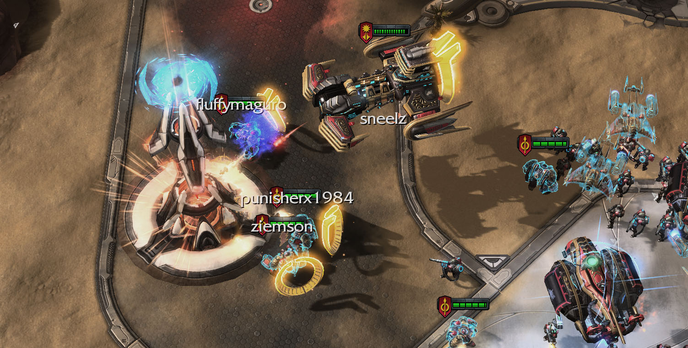

# FluffyChatBot

This Twitch chat bot connects twitch chat to StarCraft II game enabling viewers to interact witht the streamer directly. It works only on arcade maps that support this – my [MM maps](https://www.maguro.one/p/my-maps.html). Here is a [longer post on my site.](https://www.maguro.one/2020/01/fluffy-chatbot.html)

The bot has been refactored and mostly incorporated into my [StarCraft II Co-op Overlay](https://github.com/FluffyMaguro/SC2_Coop_overlay). It's generally improved and doesn't require creating new account for a bot. Only image recognition functionality hasn't been ported as it requires cv2 package and is difficult to set up for different screen resolutions.

# What the bot can do

* Basic bot stuff - responses, etc.
* Indentifies mutators that are being played through image recognition and posts them in the chat or as overlay on screen
* Calculates mutation difficulty score and equivalent Brutal+ difficulty and posts it into the chat
* Analyses replays and posts game summary in the chat
* Game integration into my [MM] maps. You can affect the game with several supported commands (!join, !message, !spawn, !mutator, !resources).

# Screenshots

**Viewers joining into the game:**

**Mutator identification through image recognition:**

**Post game summary:**

# How to use the lightweight bot

1. Create a twitch account for the bot
2. Get twich API oauth key for the bot (https://twitchapps.com/tmi/)
3. Download the config file and .exe (or python script and run/compile it yourself).
4. Change channel name, bot name, oauth key, bank locations (and optionally responses) in the config file.
5. Run the bot while playing

Commands for the streamer: 
* !gm → enables partial game integration (!join, !message). But it's on by default already.
* !gm full → enables full game integration (!mutator, !spawn, !resources)
* !gm stop → disables all game integration

Editing responses:

* You add or remove them as you wish (except "RESPONSE", removing that one might throw an error)
* For example if you add `SNOW = It's snowing!`, if someone writes "!snow", the bot will say "It's snowing!"
